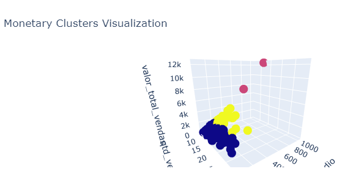
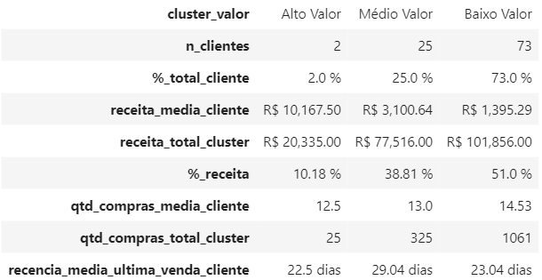
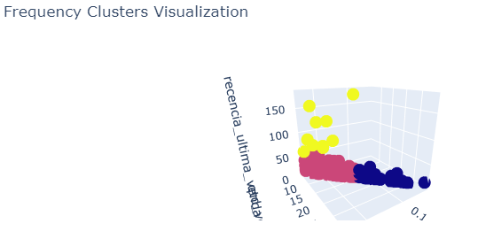
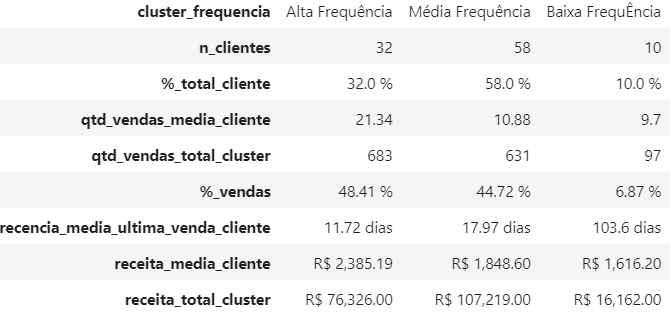
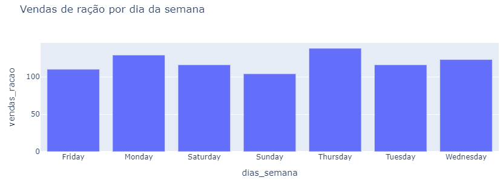
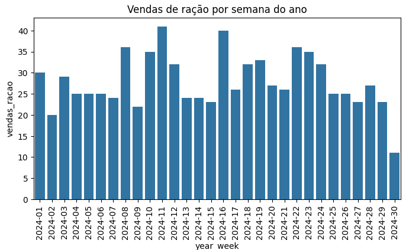
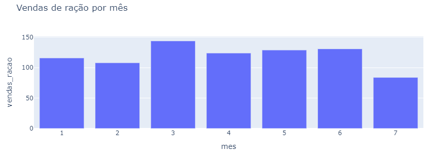

# 1) Problema de Negócio
O Grupo Petz é um ecossistema em crescimento que atende o mercado pet (relação tutor-pet). A atuação conta com lojas físicas para comercialização de produtos e prestação de variados serviços para pets, loja tipo e-commerce, além de possuir diversas marcas reconhecidas. 

Para sustentar o plano de crescimento da empresa, o setor de marketing e negócios procurou o time de Dados para entendimento da base de clientes e assim elaborar estratégias para fortalecer a relação e gerar mais receita: 
*	A partir do registro de vendas, agrupar os clientes em duas categorias: Valor (Alto, Médio, Baixo) e Frequência de vendas (Alta, Média, Baixa).    

*	A partir do registro de vendas, fazer a previsão da próxima venda de ração para cada cliente.

## Objetivos

* 1: Disponibilizar o agrupamento dos clientes em base ao Valor e em base à Frequência, descrevendo as principais características de cada grupo. 

* 2: Disponibilizar previsão da próxima venda de ração para cada cliente.

# 2) Premissas de Negócio
* Por não ter uma chave identificadora de vendas, todos os registros de venda foram tratados como uma venda única, mesmo que haja duas vendas na mesma data para o mesmo cliente.

* O período utilizado para cálculos de frequência de compra é o disponibilizado na base de dados, entre 01/01/2024 e 24/07/2024, total de 206 dias. Essa opção garante a melhor compreensão da relação atual de cada cliente com a empresa.

* As previsões de compra de ração com a data da realização da análise, 25/07/2024, foram consideradas válidas pois há a possibilidade de o cliente adquirir o produto após o horário da entrega da tabela. As previsões com datas anteriores não foram validadas, pois entende-se que, pelo cálculo, a compra não foi realizada. 

* A solução para o objetivo 1 será entregue na forma de tabela com a identificação dos clusters e descritivo de características.  A 2, na forma de tabela com a data da última compra de ração e a previsão da futura compra de ração.

# 3) Estratégia de Solução
O modelo escolhido para iniciar o raciocínio de clusterização dos clientes é o RFM. É baseado em 3 pilares de gerenciamento da relação de negócios e clientes:  Recência, para identificar o quanto recente foi realizada a última compra; Frequência, para identificar a taxa de compras em um determinado período; Monetarização, para identificar o valor gasto por cada cliente. Foram criadas features que remetem a esses campos de gerenciamento. 

Para previsão de vendas de ração, primeiro foi verificada a quantidade de vendas em maior granularidade de tempo. O comportamento da venda de ração foi visto como regular. A previsão das compras de ração foi calculada a partir do intervalo médio de compra de ração de cada cliente. Esse valor foi adicionado à última data de compra de ração para prever a próxima compra. 

Para as duas soluções, utilizou-se a linguagem de programação Python e seus recursos disponíveis.  

O projeto foi executado sob a metodologia de gerenciamento cíclico "Cross Industry Standard Process for Data Science" (CRISP-DS). O CRISP-DS consiste em cumprir todas as etapas de um projeto, mesmo que haja decisões entre diferentes caminhos. Toda etapa é revisitada a cada ciclo completo, podendo modificar e corrigir o desenvolvimento, até ser definida a solução final. As principais vantagens são: elaborar uma versão end-to-end ao final de cada ciclo; ganhar velocidade na entrega de solução; e conseguir mapear junto a outros times da empresa possíveis melhorias a serem implementadas na próxima iteração.

## Etapas CRISP-DS:

1. Entendimento de negócio

2. Coleta dos dados:
 
* Base de dados disponibilizada pelo time de marketing e negócios.

3. Limpeza dos dados:
 
* Fazer a descrição dos dados, ordenação de colunas, verificação de dtypes, checagem de dados faltantes, descrição estatística dos dados.

4. Análise exploratória dos dados:
  
* Feature Engineering: Criação de features e um novo dataset de trabalho:

o	Clientes; 

o	Valor total das vendas por cliente;

o	Valor do ticket médio de venda por cliente;

o	Quantidade total de vendas por cliente;

o	Frequência de vendas por cliente:  quantidade total de vendas / período analisado (206 dias);

o	Recência da última venda por cliente: diferença entre a última data de registro no dataset e a última data de venda por cliente.

* Análise univariada: 

o	Descrição estatística das variáveis: tendência central: média, mediana; dispersão: mínimo, máximo, range, desvio padrão, coeficiente de variação, skew e kurtosis.

o	Verificação gráfica da distribuição com histogramas. 

* Análise bivariada: verificação gráfica da relação das variáveis em pares.

* Análise multivariada: verificação gráfica da correlação de Pearson entre as variáveis. 

5. Modelagem dos dados:
 
* Seleção de variáveis: a partir da variância e correlação foram definidas:

o	Cluster de Valor: Valor total de vendas e Ticket Médio. Apesar de apresentarem alta correlação, também tem alta variação, interessante para capturar outliers.

o	Cluster de Frequência: Quantidade total de vendas, Frequência e Recência Última compra. Variáveis que apresentam pouca correlação entre si, mas tem variância no seu comportamento.

* Preparação dos dados: todas as variáveis foram reescaladas com MinMaxScaler(), para ter a mesma escala e os outliers preservarem o peso.

6. Algoritmos de Machine Learning:
 
* Definido modelo K-Means para clusterização. Parametrizado para 3 clusters para cada categoria, conforme solicitado.

7. Avaliação do Algoritmo:

•	Utilizada a métrica de SilhoutteScore para verificar a performance do modelo: coesão dos pontos e distância entre clusters.

•	Clusterização Valor SilhouetteScore: 0.5417

•	Clusterização Frequência SilhouetteScore: 0.4863

8. Análise dos Clusters:

* Cluster de Valor:

Eixo X = Quantidade de Vendas / Eixo Y = Ticket Médio / Eixo Z = Valor total gasto

Alto valor = vermelho / Médio Valor = amarelo / Baixo valor = azul

Profile:

 
* Cluster de Frequência:

Eixo X = Quantidade de Vendas / Eixo Y = Frequência vendas / Eixo Z = Recência última venda

Alta frequência = azul / Média frequência = vermelho / Baixa frequência = amarelo

Profile:

9. Previsão de Vendas de Ração:

* Filtragem de vendas para categoria de Ração, organizadas por cliente e em ordem crescente de data.

* Foi verificado o comportamento das vendas de ração por dia de semana, semana do ano e por mês.
 

*	Calculado o intervalo entre a data de venda mais antiga e a próxima venda, seguindo para todos os registros. A primeira data de venda recebeu valor 0.

*	Calculado o valor médio de cada intervalo de venda de ração para definir o intervalo médio de compra de ração por cliente e utilizar como parâmetro.

*	Adicionado o valor médio de intervalo na última data de venda de ração para determinar a previsão de próxima data de venda. 

*	Caso a previsão seja anterior ao dia da análise, 25/07/2024, foi considerado que a compra não foi realizada pois não há registro na base. 

# 4) Top 5 Insights
*	Cluster de Valor (Alto): 2% da base de clientes responde por 10% da receita do período. Representam alto valor monetário e podem ser categorizados como “premium” para um possível programa de fidelidade.
  
*	Cluster de Valor (Médio): 25% clientes respondem por 38% da receita do período. Pode-se trabalhar uma campanha de cross-sell de novos produtos/serviços para aumentar o ticket médio e gerar mais receita.
 
*	Cluster Frequência (Média): tendência de separação: a) clientes recentes (poucas compras/pouca frequência) mas alta recência, podem ser incentivados com descontos; b) clientes terão um downgrade para baixa frequência pois já compraram no passado e estão com baixa recência.
  
*	Cluster Frequência (Baixa): clientes específicos que tem uma alta quantidade de vendas/frequência mas baixa recência. São clientes que foram  bem ativos e demonstram ter trocado de serviço. Pode-se pensar em alguma campanha de recuperação de clientes.
  
*	Vendas de ração representam 60% dos registros de venda do período além de ter uma recorrência regularidade de receita. Pode-se utilizar esse item para aumentar a variedade e quantidade da cesta de compra (campanha de cross-sell).

# 5) Produto do Projeto

*	Tabela de Clusterização: cliente e o cluster de valor e de frequência. Descritivo do perfil dos clusters.  (aba1, case_tabelas.xlsx)

*	Tabela de Previsão de Venda de Ração: cliente, data última compra e data de previsão de compra.  (aba2, case_tabelas.xlsx)

# 6) Conclusão
O objetivo foi criar um primeiro cenário de gerenciamento da base de clientes e vendas de produtos. A primeira clusterização pode servir como baseline de comparação futura à medida que o modelo, qualidade dos dados, desenvolvimento de features se desenvolva.

A clusterização é sempre um meio para apontar direções, extrair insights e auxiliar a tomada de decisão para desenvolvimento e impulsionamento de novos projetos de gerenciamento de clientes. 

# 7) Próximos Passos

*	Com os primeiros clusters definidos, deve-se trabalhar hipóteses, fazer a Análise Exploratória dos Dados  e gerar insights por dentro de cada cluster: período de compra, categoria de compra, valor gasto.

*	Desenvolver novas features para analisar o comportamento de vendas/usuários. Exemplo: chave de identificação única por venda para análise de cesto de compra (produtos, quantidade, valor).

*	Desenvolver rótulos que possam ser inseridos na base de dados e ajudem a clusterização futura de clientes.

*	Definir targets dentro de cada cluster para serem utilizados em projeções de programas de aumento de receita, aumento de frequência, por exemplo.

*	Modelar a dimensionalidade dos dados e treinar outros modelos de clusterização.

*	Para avaliações temporais utilizar modelos de séries temporais como ARIMA para modelar o comportamento.
